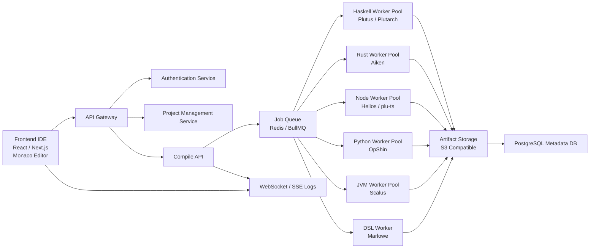
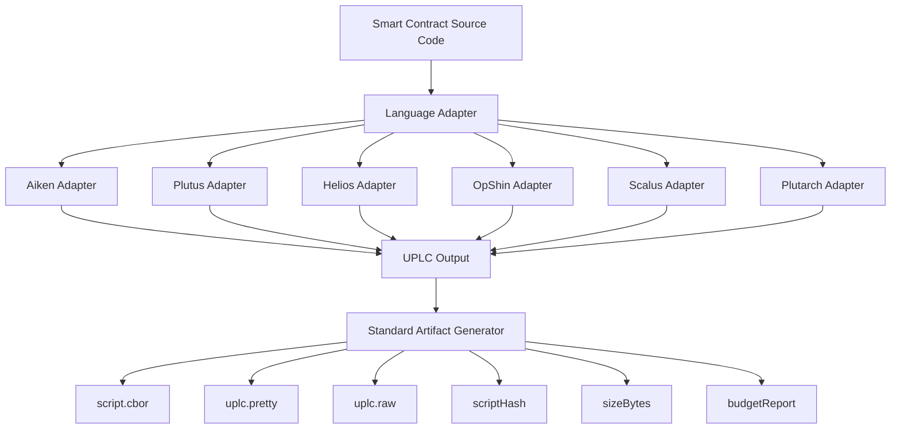
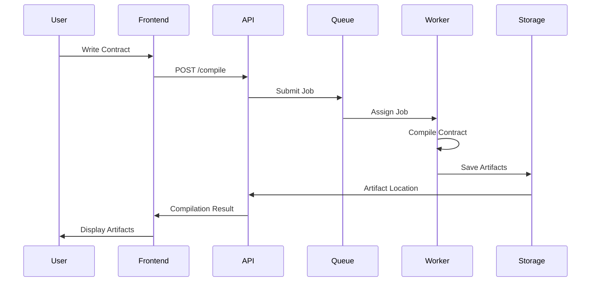

Below are **two diagrams you can directly include in your GitHub README** using **Mermaid (GitHub supports it)**.

---

# 1. Full System Architecture Diagram

This diagram shows the **complete platform architecture**.



### Explanation

The architecture is divided into **five main layers**:

#### 1️⃣ Frontend IDE

Provides the user interface.

Key components:

* Monaco code editor
* file explorer
* template manager
* artifact viewer
* compile logs

Technologies:

```
React
Next.js
TypeScript
Monaco Editor
WebSockets / SSE
```

---

#### 2️⃣ API Gateway

Handles all communication between frontend and backend.

Responsibilities:

```
authentication
project management
compile requests
workspace management
share links
```

---

#### 3️⃣ Job Queue

Compilation tasks are submitted to a **job queue system**.

Recommended stack:

```
Redis
BullMQ
```

Responsibilities:

```
job scheduling
job priority
concurrency control
worker distribution
```

---

#### 4️⃣ Worker Pools

Different languages require **different runtime environments**.

Each language is compiled inside a **dedicated worker container**.

Examples:

| Worker Type | Runtime           |
| ----------- | ----------------- |
| Haskell     | Plutus / Plutarch |
| Rust        | Aiken             |
| Node        | Helios            |
| Python      | OpShin            |
| JVM         | Scalus            |
| DSL         | Marlowe           |

Workers perform:

```
contract compilation
artifact generation
UPLC conversion
budget evaluation
```

---

#### 5️⃣ Artifact Storage

All compilation results are stored in **object storage**.

Stored artifacts:

```
UPLC scripts
CBOR files
script hashes
budget reports
compile logs
```

Recommended storage:

```
AWS S3
MinIO
Cloudflare R2
```

---

# 2. Language Adapter Architecture Diagram

Your platform uses an **Adapter-Based Compiler Architecture**.

This allows the IDE to support **multiple Cardano languages without rewriting the core system**.



---

## Adapter Responsibilities

Each adapter must implement:

```
compile()
evaluate()
simulate()
normalizeArtifacts()
```

---

### Adapter Interface Concept

Example conceptual interface:

```
LanguageAdapter

id
displayName
network
mode

editor configuration

toolchains

compile()
evaluate()
simulate()

normalizeArtifacts()
fixtures
```

---

### Why Adapter Architecture is Important

Benefits:

#### 1️⃣ Language Extensibility

New languages can be added without modifying the platform core.

Example:

```
Add Pebble adapter
Add plu-ts adapter
```

---

#### 2️⃣ Unified Outputs

Even though languages differ, the system always produces the same artifacts:

```
UPLC
CBOR
scriptHash
sizeBytes
budgetReport
```

---

#### 3️⃣ Deterministic Builds

Adapters enforce **consistent build processes**.

This ensures:

```
reproducible smart contracts
consistent hashes
reliable audit results
```

---

# 3. Worker Execution Flow

This diagram shows how a **compile request travels through the system**.



---

# Recommended Section to Add to Your README

After **Technical Architecture**, add:

```
## System Architecture

The platform uses a modular architecture consisting of:

Frontend IDE
API Gateway
Job Queue
Worker Pools
Artifact Storage

See the architecture diagram below.
```

Then include the diagram.

---

# If you want, I can also give you **3 extremely valuable additions** for your project:

### 1️⃣ **Complete GitHub Repository Starter Template**

Includes:

```
frontend
backend
workers
language-adapters
offchain
scripts
docker
docs
```

---

### 2️⃣ **40+ GitHub Issues for Contributors**

Example:

```
Issue #1 Setup Monaco Editor
Issue #2 Implement Compile API
Issue #3 Build Aiken Adapter
Issue #4 Implement Artifact Storage
```

This helps **multiple developers collaborate efficiently**.

---

### 3️⃣ **Cardano Playground Database Schema**

Including tables for:

```
projects
project_versions
compile_jobs
artifacts
toolchains
share_links
```
