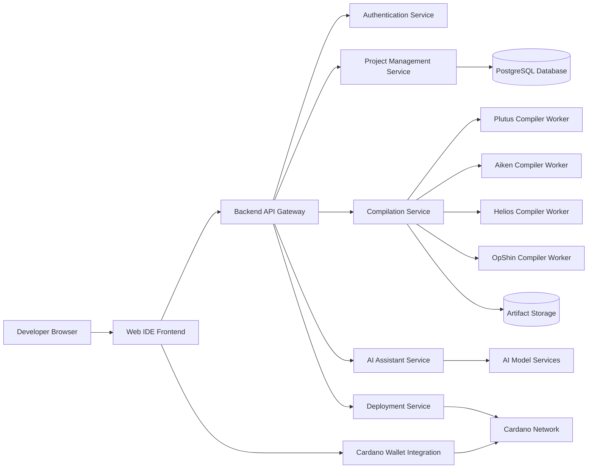
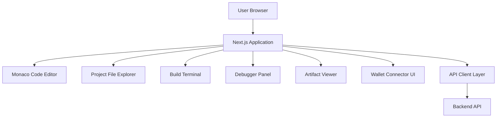
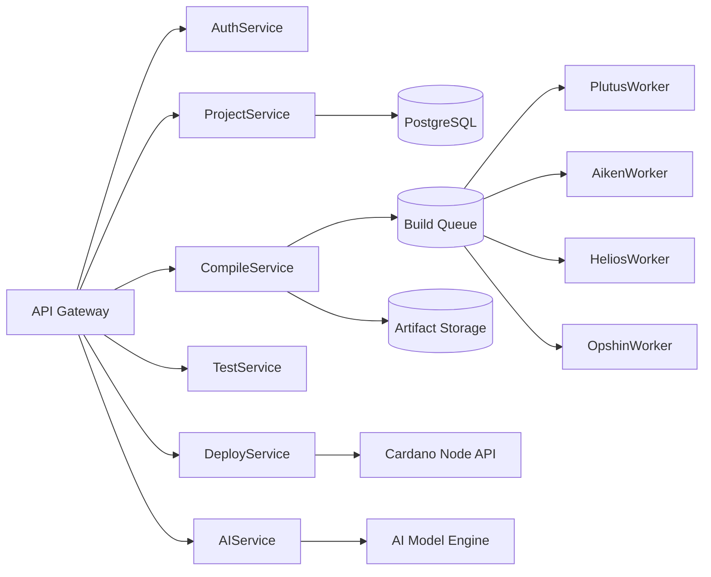
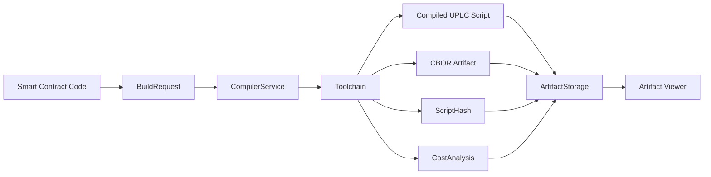
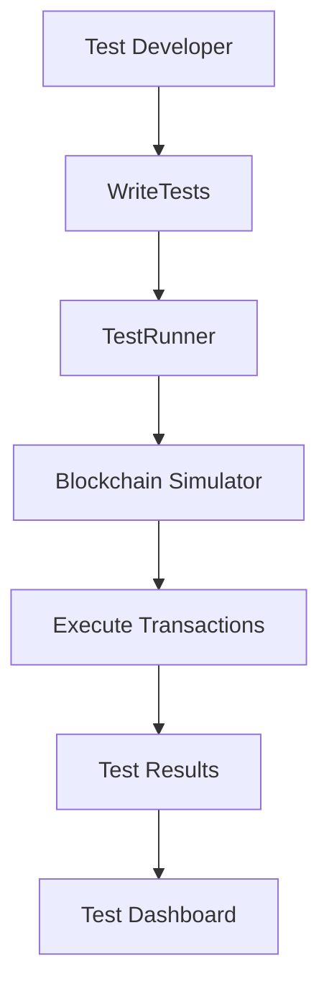
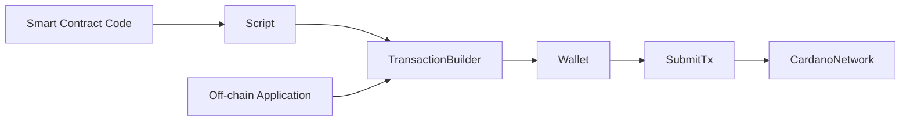
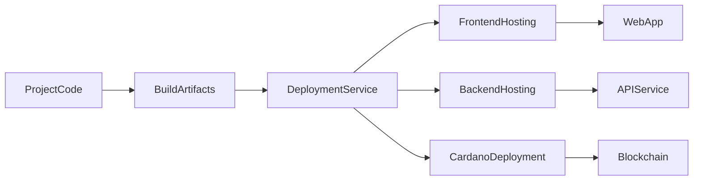
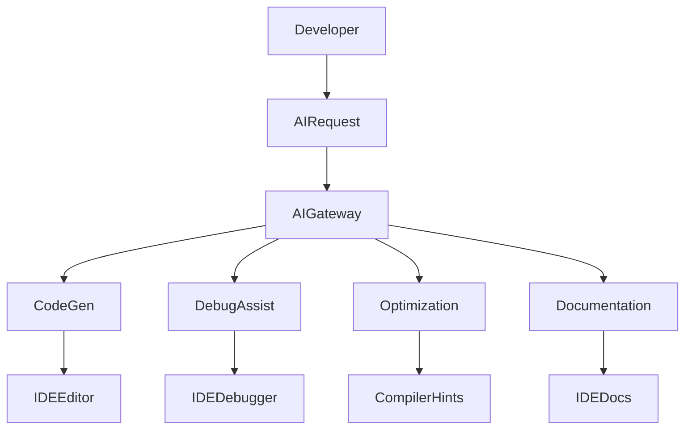
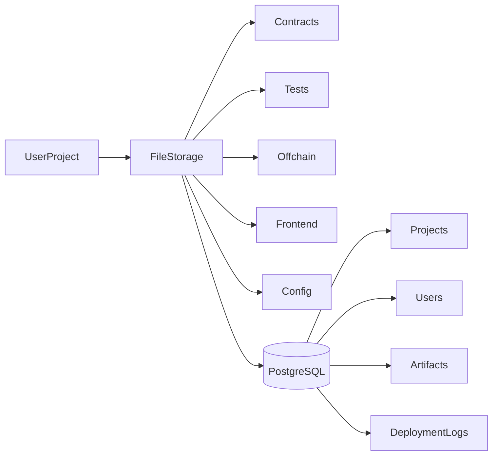
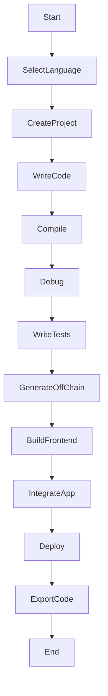

# Architecture Diagrams for Plutus Playground Studio

These diagrams illustrate the **core system architecture, services, and workflows** that implement the usability flow specification.

---

# 1. High-Level System Architecture

This diagram shows the **main components of the platform**.

### Key Insight

The architecture separates:

* **Frontend IDE**
* **API layer**
* **Compiler workers**
* **AI services**
* **Blockchain deployment**

This ensures the platform is **scalable and language-agnostic**.

---

# 2. Frontend IDE Architecture

This diagram explains the **browser development environment**.

### Responsibilities

Frontend handles:

* project navigation
* editing smart contracts
* running builds
* displaying artifacts
* debugging traces
* wallet interaction

---

# 3. Backend Service Architecture

This diagram explains how **backend services are organized**.

### Key Architecture Decision

Compilation is handled by **worker queues** to allow:

* horizontal scaling
* language-specific environments
* containerized builds

---

# 4. Smart Contract Compilation Pipeline

This diagram shows how code becomes **deployable blockchain scripts**.

---

# 5. Smart Contract Testing Architecture

Testing supports:

* unit tests
* simulation
* integration tests
* property tests

---

# 6. On-Chain / Off-Chain Integration Architecture

This layer connects:

* **smart contracts**
* **wallet interactions**
* **transaction building**

---

# 7. Deployment Architecture

This enables **WordPress-style deployment for dApps**.

---

# 8. AI Assisted Development Architecture

---

# 9. Project Storage Architecture

---

# 10. Developer Workflow Diagram

This diagram matches your **Usability Flow Specification**.

---
